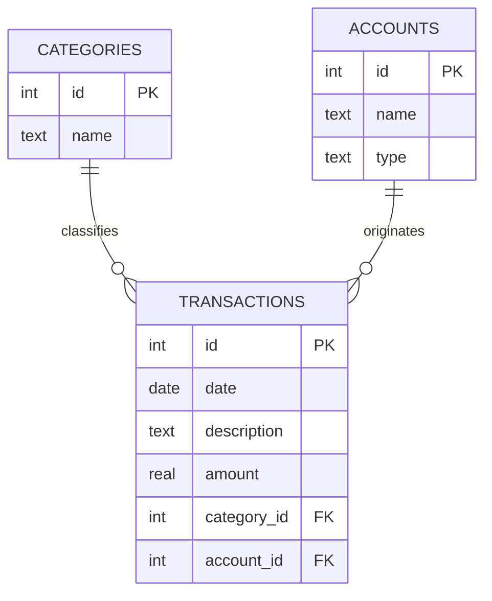
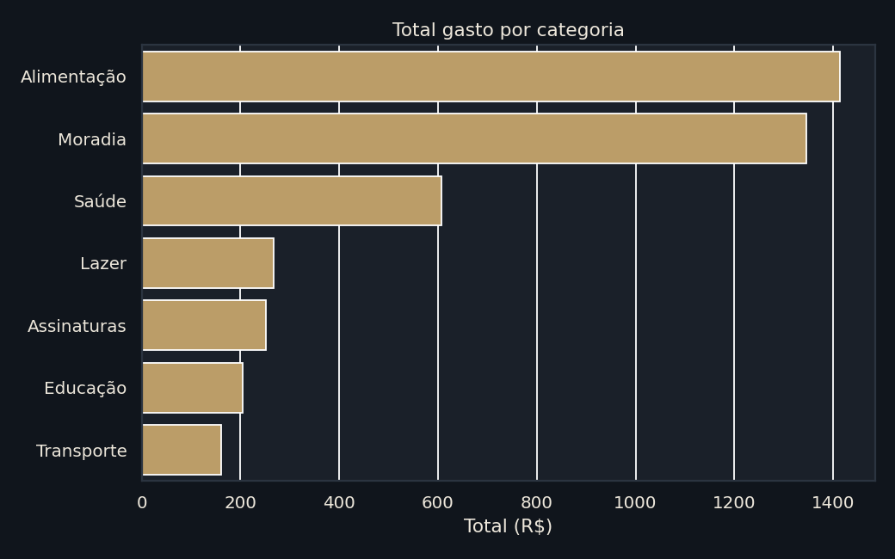
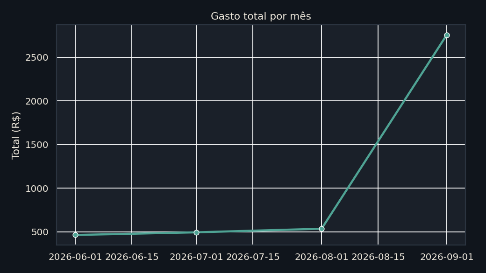
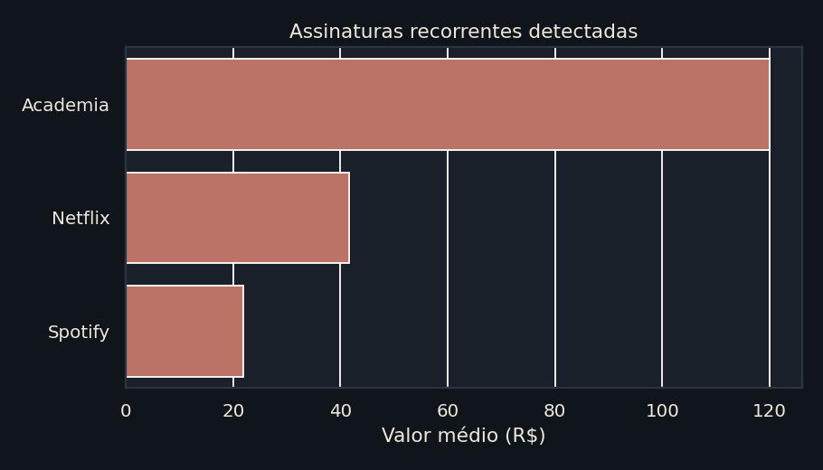

<div align="center">

# 💰 Personal Expense Analyzer

### A mini personal finance control system built with pure SQL & Python


Record your expenses, organize by category and account, and discover where<br>your money is going — all with SQL queries.

**[→ Open the live SQL playground](https://isadorambt.github.io/Analisador-de-Gastos-Pessoais/)**

</div>

---

## 🌐 Live SQL Playground

This repository includes an interactive page (`index.html`) that runs the entire database **directly in your browser** via WebAssembly (using [sql.js](https://sql.js.org/)) — no server, no back-end needed. Visitors can write and run real queries against the database and see results, including simple charts when applicable.

To enable this in your own repository: `Settings` → `Pages` → set "Source" to `main` branch and `/ (root)` folder → Save. Within minutes your site will be live!

---

## 📐 Database Schema



## ✨ Features

- 🗂️ **Categorization** of expenses (Food, Transport, Entertainment, Housing...)
- 💳 **Multiple accounts & cards** tracked separately
- 📊 **Aggregate reports** — totals and averages by category, account, period
- 🔎 **Ready-made queries**, from basic (`SELECT`, `WHERE`) to advanced (`JOIN`, `GROUP BY`)

### 🕒 Cost in Hours of Life

Every expense is converted to "how many hours of your work it cost", based on your hourly rate. A $500 rent becomes **26 hours of work per month** — a perspective from the classic *Your Money or Your Life*. Implemented as a `VIEW` (`expenses_in_hours`) that crosses transactions with your hourly rate stored in `profile`.

### 🔍 Forgotten Subscription Detector

A query uses **window functions** (`LAG`) to compare each transaction with the previous one with the same description, calculating the interval in days and the difference in value. Charges with ~30-day intervals and similar values are flagged as possible recurring subscriptions — useful for finding that streaming service or gym membership you forgot about.

### ✅ Automated Testing

The CI not only checks if SQL runs without error — it also validates if **results** are mathematically correct: totals by category sum to the overall total, the subscription detector finds exactly the expected recurrences (no more, no less), hourly cost calculations match the registered hourly rate, and there are no "orphan" transactions pointing to non-existent categories or accounts.

## 🚀 How to Use

```bash
# Clone the repository
git clone https://github.com/isadorambt/Analisador-de-Gastos-Pessoais.git
cd Analisador-de-Gastos-Pessoais

# Create the database from scratch
sqlite3 gastos.db < schema.sql

# Populate with example data
sqlite3 gastos.db < seed.sql

# Run example queries
sqlite3 gastos.db < consultas.sql
```

> 💡 Don't have `sqlite3` installed? Python 3 comes with the `sqlite3` module built-in — you can run the same scripts with `python3` instead.

### Running Analysis in Python (pandas)

```bash
pip install -r requirements.txt

# Generate charts in analise/graficos/
python3 analise/gerar_graficos.py

# Open the full notebook (Jupyter or VS Code)
jupyter notebook analise/analise_gastos.ipynb
```

## 📁 Project Structure

| File | Description |
|------|-------------|
| `schema.sql` | Creates tables and their relationships |
| `seed.sql` | Populates the database with example data |
| `consultas.sql` | Example queries, from basic to advanced |
| `gastos.db` | SQLite database ready to use |
| `index.html` | Interactive SQL playground (runs in browser) |
| `.github/workflows/ci.yml` | CI that validates SQL and pandas analysis on each commit |
| `nl2sql.js` | Translator for natural language queries to SQL (pattern-based) |
| `tests/test_nl2sql.js` | Tests for the translator (Node.js) |
| `tests/test_gastos.py` | Automated tests for SQL query results |
| `analise/analysis.py` | Pandas module with equivalent analyses in Python |
| `analise/gerar_graficos.py` | Generates charts (matplotlib + seaborn) |
| `analise/analise_gastos.ipynb` | Jupyter notebook with complete analysis, already executed |
| `tests/test_analysis.py` | Tests comparing pandas vs SQL, result by result |

## 📊 Example Results

Running the total spent by category query (with 4 months of history):

| Category | Total ($) | Transactions |
|----------|----------:|:-------------:|
| Food | 1,413.85 | 6 |
| Housing | 1,345.00 | 2 |
| Health | 606.30 | 6 |
| Entertainment | 267.00 | 3 |
| Subscriptions | 252.20 | 8 |
| Education | 205.00 | 2 |
| Transport | 160.50 | 3 |

## 🐍 Analysis in Python (pandas)

In addition to SQL, the project has an equivalent **pandas** module (`analise/analysis.py`) that solves the same questions — totals by category, cost in hours, subscription detector, balance projection — using Python instead of pure SQL. Tests in `tests/test_analysis.py` compare both approaches and confirm results match.

The notebook `analise/analise_gastos.ipynb` is pre-executed with tables and charts below:





## 🛠️ Tech Stack Used

- **SQL**: Complex queries, window functions, CTEs, views
- **SQLite**: Lightweight, serverless database
- **Python 3**: Data processing and analysis
- **Pandas**: Data manipulation and aggregation
- **Jupyter Notebook**: Interactive data exploration
- **GitHub Actions**: Automated testing and CI/CD
- **WebAssembly (sql.js)**: Browser-based SQL execution
- **Matplotlib & Seaborn**: Data visualization

## 🗺️ Roadmap

- [ ] Budget table (limit per category) with overspend alerts
- [ ] Month-over-month spending comparison
- [ ] Monthly summary view
- [x] Charts with Python + matplotlib
- [x] Balance projection (when money runs out at current pace)
- [x] Natural language queries (ask in English, translate to SQL)

---

## 🎯 Key Learnings & Best Practices

This project demonstrates:

✅ **Advanced SQL**: Window functions, CTEs, complex JOINs, aggregations
✅ **Data Validation**: Automated tests ensure data integrity
✅ **CI/CD Pipeline**: GitHub Actions for continuous validation
✅ **Multi-language Analysis**: SQL + Python for the same business logic
✅ **Interactive UI**: WebAssembly-based SQL playground
✅ **Documentation**: Clear schema, examples, and usage instructions

---

<div align="center">

**Made with 💡 and SQL by [@isadorambt](https://github.com/isadorambt)**

*If this project helped you, consider giving it a ⭐*

</div>