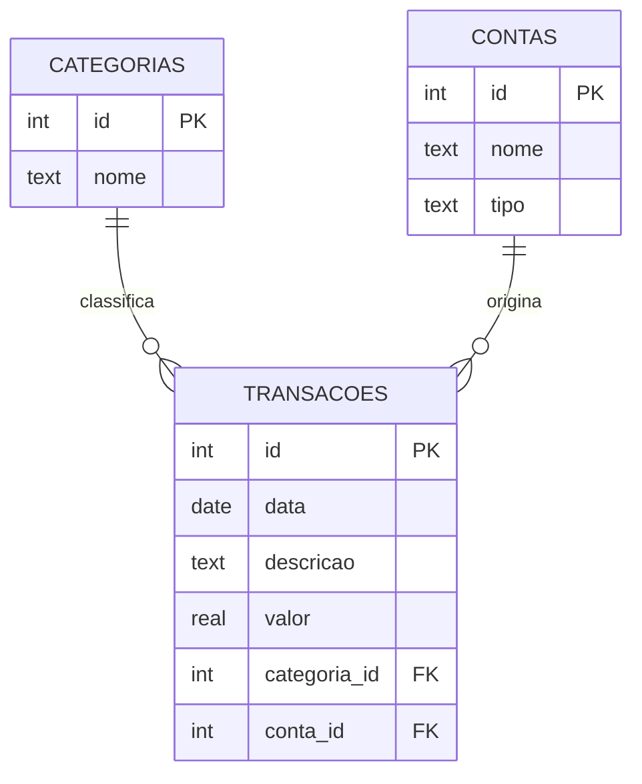

<div align="center">

# 💰 Analisador de Gastos Pessoais

### Um mini sistema de controle financeiro construído em SQL puro


Registre seus gastos, organize por categoria e conta, e descubra pra onde<br>seu dinheiro está indo — tudo com consultas SQL.

**[→ Abrir o playground SQL ao vivo](https://isadorambt.github.io/Analisador-de-Gastos-Pessoais/)**

</div>

---

## 💬 Pergunte em português

O playground tem uma caixa onde você digita uma pergunta em português —
"quanto gastei com Alimentação?", "quais são minhas assinaturas?" — e ela é
traduzida pra SQL e executada na hora.

**Importante ser honesta sobre o que isso é:** não é um LLM (não existe API
de IA rodando por trás). É um **tradutor por padrões**, implementado em
`nl2sql.js` — normaliza o texto (remove acentos, minúsculas), reconhece um
conjunto fixo de formatos de pergunta com expressões regulares, e monta o
SQL correspondente. Funciona 100% no navegador, sem servidor e sem custo,
mas só entende as perguntas que ele foi programado pra reconhecer.
Testado em `tests/test_nl2sql.js` (roda com Node, sem dependências).

## 🌐 Playground SQL ao vivo

Esse repositório inclui uma página (`index.html`) que roda o banco **inteiro
no navegador**, via WebAssembly (usando [sql.js](https://sql.js.org/)) — sem
servidor, sem back-end. Qualquer visitante pode escrever e rodar consultas
reais contra o banco de dados e ver o resultado, inclusive um gráfico simples
quando a consulta tem esse formato.

Pra ativar o link acima no seu próprio repositório: `Settings` → `Pages` →
em "Source" escolha a branch `main` e a pasta `/ (root)` → salvar. Em alguns
minutos o site fica disponível no endereço mostrado ali.

---

## 📐 Modelo do banco de dados



## ✨ Funcionalidades

- 🗂️ **Categorização** de gastos (Alimentação, Transporte, Lazer, Moradia...)
- 💳 **Múltiplas contas e cartões** rastreados separadamente
- 📊 **Relatórios agregados** — total e média por categoria, por conta, por período
- 🔎 **Consultas prontas**, do básico (`SELECT`, `WHERE`) ao avançado (`JOIN`, `GROUP BY`)

### 🕒 Custo em horas de vida

Todo gasto é convertido em "quantas horas do seu trabalho ele custou", baseado
na sua remuneração por hora. Um aluguel de R$ 1.200 deixa de ser só um número
e passa a ser **26,7 horas de trabalho por mês** — uma forma de enxergar
gastos que vem do clássico *Your Money or Your Life*. Implementado como uma
`VIEW` (`gastos_em_horas`) que cruza a tabela de transações com o valor da
sua hora, guardado em `perfil`.

### 🔍 Detector de assinaturas esquecidas

Uma consulta usa **window functions** (`LAG`) pra comparar cada transação com
a anterior de mesma descrição, calculando o intervalo de dias e a diferença
de valor entre elas. Cobranças com ~30 dias de intervalo e valor parecido são
sinalizadas como possíveis assinaturas recorrentes — útil pra achar aquele
streaming ou academia que você esqueceu que ainda paga.

### ✅ Testes automatizados

O CI não só confere se o SQL roda sem erro — ele também valida se os
**resultados** estão matematicamente corretos: a soma dos totais por
categoria bate com o total geral, o detector de assinaturas encontra
exatamente as recorrências esperadas (nem mais, nem menos), o cálculo de
horas de trabalho bate com o valor da hora cadastrado, e não existem
transações "órfãs" apontando pra categorias ou contas inexistentes.

## 🚀 Como usar

```bash
# clonar o repositório
git clone https://github.com/isadorambt/Analisador-de-Gastos-Pessoais.git
cd Analisador-de-Gastos-Pessoais

# criar o banco a partir do zero
sqlite3 gastos.db < schema.sql

# popular com dados de exemplo
sqlite3 gastos.db < seed.sql

# rodar as consultas de exemplo
sqlite3 gastos.db < consultas.sql
```

> 💡 Não tem o `sqlite3` instalado? O módulo `sqlite3` do Python já vem
> embutido — dá pra rodar os mesmos scripts com `python3` também.

### Rodando a análise em Python (pandas)

```bash
pip install -r requirements.txt

# gerar os gráficos em analise/graficos/
python3 analise/gerar_graficos.py

# abrir o notebook completo (Jupyter ou VS Code)
jupyter notebook analise/analise_gastos.ipynb
```

## 📁 Estrutura do projeto

| Arquivo         | Descrição                                        |
|-----------------|---------------------------------------------------|
| `schema.sql`    | Cria as tabelas e seus relacionamentos             |
| `seed.sql`      | Popula o banco com dados de exemplo                |
| `consultas.sql` | Consultas de exemplo, do básico ao avançado        |
| `gastos.db`     | Banco de dados SQLite já pronto para uso           |
| `index.html`    | Playground SQL interativo (roda no navegador)      |
| `.github/workflows/ci.yml` | CI que valida o SQL e a análise em pandas a cada commit |
| `nl2sql.js` | Tradutor de perguntas em português para SQL (por padrões) |
| `tests/test_nl2sql.js` | Testes do tradutor, em Node.js |
| `tests/test_gastos.py` | Testes automatizados dos resultados das consultas SQL |
| `analise/analysis.py` | Módulo pandas com as mesmas análises, em Python |
| `analise/gerar_graficos.py` | Gera os gráficos (matplotlib + seaborn) |
| `analise/analise_gastos.ipynb` | Notebook Jupyter com a análise completa, já executado |
| `tests/test_analysis.py` | Testes que comparam pandas contra SQL, resultado a resultado |

## 📊 Exemplo de resultado

Rodando a consulta de total gasto por categoria (com o histórico de 4 meses):

| Categoria     | Total (R$) | Transações |
|---------------|-----------:|:----------:|
| Alimentação   |   1.413,85 |     6      |
| Moradia       |   1.345,00 |     2      |
| Saúde         |     606,30 |     6      |
| Lazer         |     267,00 |     3      |
| Assinaturas   |     252,20 |     8      |
| Educação      |     205,00 |     2      |
| Transporte    |     160,50 |     3      |

## 🐍 Análise em Python (pandas)

Além do SQL, o projeto tem um módulo equivalente em **pandas**
(`analise/analysis.py`) que resolve as mesmas perguntas — total por
categoria, custo em horas, detector de assinaturas, projeção de saldo —
usando Python em vez de SQL puro. Os testes em `tests/test_analysis.py`
comparam os dois caminhos e confirmam que os resultados batem.

O notebook `analise/analise_gastos.ipynb` já vem executado, com as
tabelas e os gráficos abaixo:


## 🗺️ Roadmap

- [ ] Tabela de orçamento (limite por categoria) com alerta de estouro
- [ ] Comparação de gasto mês a mês
- [ ] View de resumo mensal
- [x] Gráficos com Python + matplotlib
- [x] Projeção de saldo (quando o dinheiro acaba, no ritmo atual)
- [x] Consulta em linguagem natural (perguntar em português, traduzir pra SQL)

---

<div align="center">

Feito com 🧠 e SQL por [@isadorambt](https://github.com/isadorambt)

</div>
