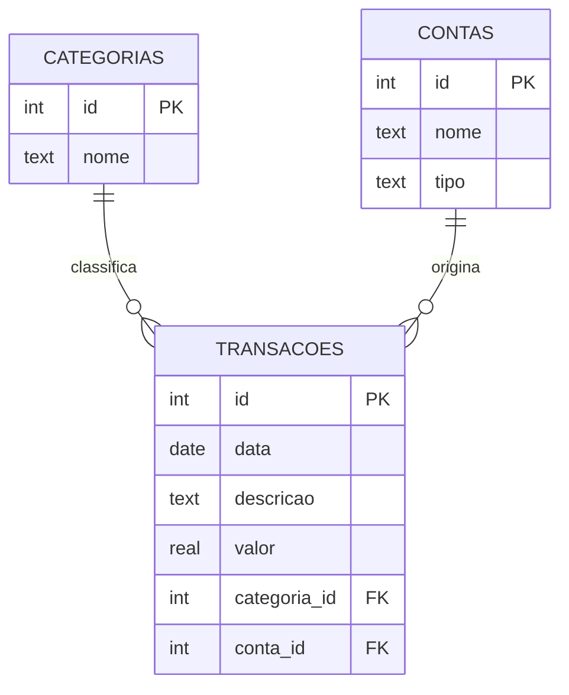

<div align="center">

# 💰 Analisador de Gastos Pessoais

### Um mini sistema de controle financeiro construído em SQL puro


Registre seus gastos, organize por categoria e conta, e descubra pra onde<br>seu dinheiro está indo — tudo com consultas SQL.

</div>

---

## 📐 Modelo do banco de dados



## ✨ Funcionalidades

- 🗂️ **Categorização** de gastos (Alimentação, Transporte, Lazer, Moradia...)
- 💳 **Múltiplas contas e cartões** rastreados separadamente
- 📊 **Relatórios agregados** — total e média por categoria, por conta, por período
- 🔎 **Consultas prontas**, do básico (`SELECT`, `WHERE`) ao avançado (`JOIN`, `GROUP BY`)

## 🚀 Como usar

```bash
# clonar o repositório
git clone https://github.com/isadorambt/Analisador-de-Gastos-Pessoais.git
cd Analisador-de-Gastos-Pessoais

# criar o banco a partir do zero
sqlite3 gastos.db < schema.sql

# popular com dados de exemplo
sqlite3 gastos.db < seed.sql

# rodar as consultas de exemplo
sqlite3 gastos.db < consultas.sql
```

> 💡 Não tem o `sqlite3` instalado? O módulo `sqlite3` do Python já vem
> embutido — dá pra rodar os mesmos scripts com `python3` também.

## 📁 Estrutura do projeto

| Arquivo         | Descrição                                        |
|-----------------|---------------------------------------------------|
| `schema.sql`    | Cria as tabelas e seus relacionamentos             |
| `seed.sql`      | Popula o banco com dados de exemplo                |
| `consultas.sql` | Consultas de exemplo, do básico ao avançado        |
| `gastos.db`     | Banco de dados SQLite já pronto para uso           |

## 📊 Exemplo de resultado

Rodando a consulta de total gasto por categoria:

| Categoria     | Total (R$) | Transações |
|---------------|-----------:|:----------:|
| Moradia       |   1.345,00 |     2      |
| Alimentação   |     588,45 |     3      |
| Lazer         |     225,00 |     2      |
| Educação      |     205,00 |     2      |
| Transporte    |     138,50 |     2      |
| Saúde         |      67,90 |     1      |

## 🗺️ Roadmap

- [ ] Tabela de orçamento (limite por categoria) com alerta de estouro
- [ ] Comparação de gasto mês a mês
- [ ] View de resumo mensal
- [ ] Gráficos com Python + matplotlib

---

<div align="center">

Feito com 🧠 e SQL por [@isadorambt](https://github.com/isadorambt)

</div>
